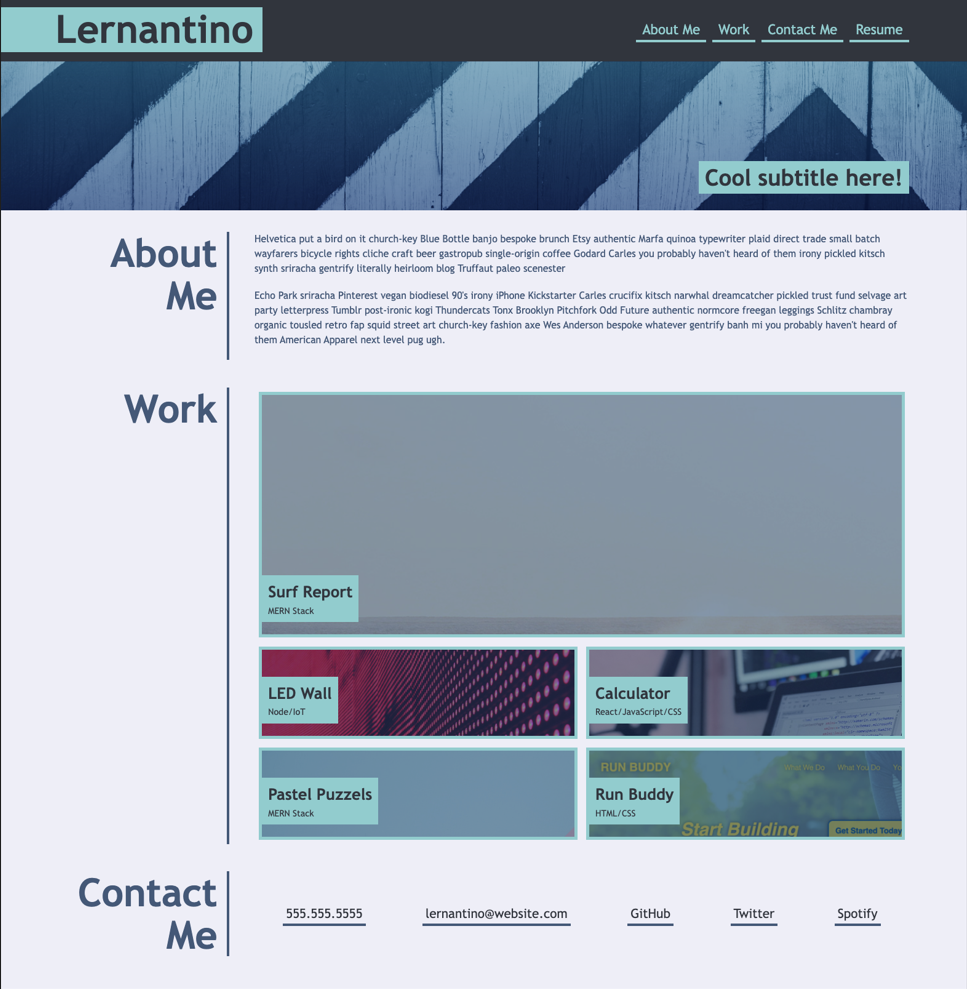
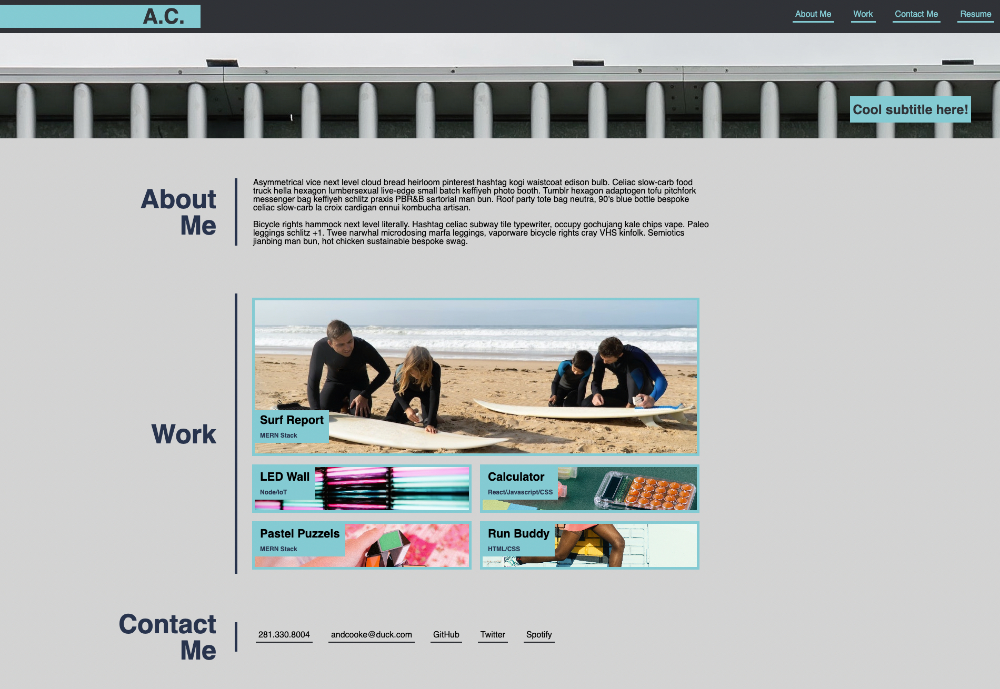

Website can be accessed at: https://andcooke.github.io/portfolio-clone/

The intent of this page was to try to pixel-perfect clone a portfolio page. 

# The Original

The original page, found below, was designed and made by an uncredited source at Trilogy. 

# My Version

Clearly, there are issues. The colors aren't quite right. The images are different. It's not exactly pixel-perfect in anyway, but the design is almost identical.

# My Process

I first made a stripped down version of that page found here: https://andcooke.github.io/challenge-2/

This version is made with my first webpage and filler options for future pages and apps.

I had major help from Meg Meyers with a lot of this code. Without her it wouldn't have been possible. 

# Image Attribution: 

The fence image - Scott Webb on Pexels
The surfing image - Kampus Production on Pexels
The led image - Stanislav Kondratiev on Pexels
The calculator image - Nataliya Vaitkevich on Pexels
The puzzle image - RF._.studio on Pexels
The running image - godisable Jacob on Pexels
